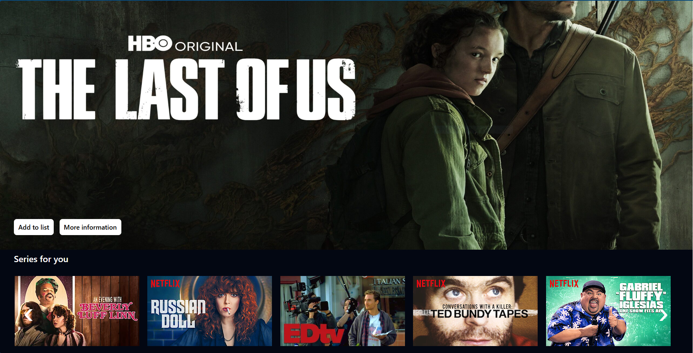

# MoviesMax

## About MoviesMax
As a pop culture enthusiast, I developed PopCultureApp to connect people who share the same passion. This application allows users to discover and obtain detailed information about their favorite movies and TV shows. Additionally, they can rate, comment, and save titles in customized lists, creating an interactive and engaging experience. The platform is designed to be intuitive and user-friendly, encouraging interaction and the exchange of opinions among users.

- Demo: https://moviesmax.vercel.app/

## Stack
- JavaScript, TypeScript, CSS, HTML
- React
- React Hooks
- React Router Dom
- Axios
- JSON

## How to run
1º: Clone the repository:
`git clone https://github.com/Matheus-Rodrigues-Araujo/MoviesMax.git`

2º: Install the dependecies:
`npm install` or `yarn install`

3º: Execute
`npm run dev` or `yarn dev`

4º: Have fun and may the code be with you! :)

## Screenshots

